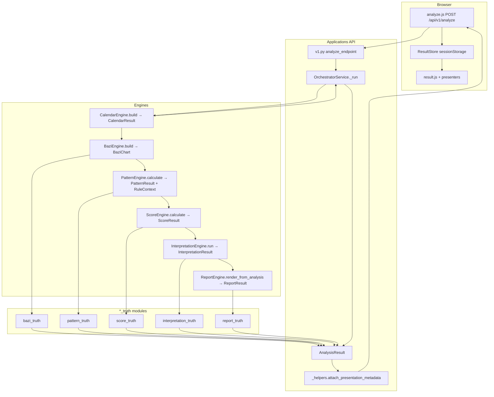

# BTE Platform V1.0 — Production Architecture Certification

**Phase:** 7 — Production Architecture Certification  
**Date:** 2026-07-27  
**Scope:** Phases 2–6 implementation (no feature development, no legacy cleanup)  
**Method:** Static architecture audit + full regression run + production request trace

---

## Executive summary

The production pipeline **Calendar → Bazi → Pattern → Score → Interpretation → Report → AnalysisResult → API → Portal** is implemented and wired as a single orchestrated path. Each engine slice has one authoritative producer on the production path. The API serializes `AnalysisResult` view slices without recalculating engine logic. The Portal reads stored API payloads and does not re-invoke engines.

**Certification verdict:** **CONDITIONAL PASS**

Production architecture satisfies the contract. Documented exceptions (calendar shaping in Applications layer, narrative content identical to report, legacy tests and golden dataset tooling) are isolated from the production path and listed under Remaining risks.

---

## Architecture diagram



**Parallel (not in main chain):** `FengShuiEngine.calculate` → `payload["feng_shui"]` only; enriches `payload["calendar"]` via orchestrator `_shape_calendar`.

---

## Verification checklist

| # | Requirement | Status | Evidence |
|---|-------------|--------|----------|
| 1 | Every data type has exactly ONE producer | **PASS** | See Producer table; `AnalysisResult` is assembled once in orchestrator |
| 2 | Every producer has documented consumers | **PASS** | See Consumer tables |
| 3 | No duplicate producer exists | **PASS** (production) | Legacy engines exist in repo but are not imported by orchestrator/API |
| 4 | No duplicate serializer exists | **PASS** (with note) | Intentional two-layer: engine `to_portal_dict` → `*_truth` → `*View.to_dict`; no alternate shaping logic |
| 5 | No duplicate RuleContext exists | **PASS** | Built once in `pattern_engine/rule_context_bridge.py`; Score appends score slice only |
| 6 | No duplicate API shaping exists | **PASS** (with note) | `_shape_calendar` is sole Applications-layer shaping; report/interpretation shaping removed from orchestrator |
| 7 | Portal renders only API payload | **PASS** | `result.js` reads `ResultStore`; no engine POST on result page |
| 8 | Portal never rebuilds data | **PASS** | Display labels/fallbacks only; `summary_builder.js` explicitly does not calculate business values |
| 9 | API never recalculates data | **PASS** | Routes delegate to `orchestrator.run_stage` / `analyze`; metadata attachment only |
| 10 | No production code imports legacy implementations | **PASS** | Orchestrator imports engine Public APIs only; no `NarrativeEngine`, `IntegrationOrchestrator`, or legacy builders |

---

## Producer table

| Result type | Producer | Method | Authoritative storage | View / serializer | Truth module |
|-------------|----------|--------|----------------------|-------------------|--------------|
| **CalendarResult** | `engines/calendar_engine/engine.py` → `CalendarEngine` | `build()` | `payload["calendar"]` (not on `AnalysisResult`) | `OrchestratorService._shape_calendar()` + `to_jsonable()` | None (`calendar_truth` not implemented) |
| **BaziChart** | `engines/bazi_engine/engine.py` → `BaziEngine` | `build(calendar, gender)` | `analysis.bazi` → `BaziView` | `BaziView.to_dict()` | `applications/api/services/bazi_truth.py` |
| **PatternResult** | `engines/pattern_engine/engine.py` → `PatternEngine` | `calculate(PatternContext)` | `analysis.pattern` → `PatternView`; `analysis.rule_context` | `PatternResult.to_portal_dict()` → `PatternView.to_dict()` | `applications/api/services/pattern_truth.py` |
| **ScoreResult** | `engines/score_engine/engine.py` → `ScoreEngine` | `calculate(rule_context)` | `analysis.score` → `ScoreView`; updates `rule_context` | `ScoreResult.to_portal_dict()` → `ScoreView.to_dict()` | `applications/api/services/score_truth.py` |
| **InterpretationResult** | `engines/interpretation_engine/engine.py` → `InterpretationEngine` | `run(rule_context)` | `analysis.interpretation` → `InterpretationView` | `InterpretationResult.to_portal_dict()` → `interpretation_engine/portal_view.py` → `InterpretationView.to_dict()` | `applications/api/services/interpretation_truth.py` |
| **ReportResult** | `engines/report_engine/engine.py` → `ReportEngine` | `render_from_analysis(analysis)` | `analysis.report` → `ReportView`; `analysis.narrative` → `NarrativeView` | `ReportResult.to_portal_*_dict()` → `report_engine/portal_view.py` → `*View.to_dict()` | `applications/api/services/report_truth.py` |
| **AnalysisResult** | `applications/api/services/orchestrator.py` → `OrchestratorService` | `_run()` | In-memory per request; serialized to API `data` | `analysis.*_dict()` methods | Per-slice `*_truth` modules |

### RuleContext

| Action | Location | Production? |
|--------|----------|-------------|
| **Build** (calendar + bazi + pattern) | `engines/pattern_engine/rule_context_bridge.py` → `build_rule_context()` | **Yes** — sole build |
| **Append score slice** | `ScoreEngine.append_score_to_rule_context()` | **Yes** — mutation, not rebuild |
| **Legacy rebuild** | `ScoreEngine._resolve_rule_context()`, `InterpretationEngine._resolve_rule_context()` | **No** — orchestrator always passes dict from Pattern |

---

## Consumer table

### Engine results → downstream

| Producer output | Direct consumers |
|-----------------|------------------|
| `CalendarResult` | Orchestrator (`_shape_calendar`), `BaziEngine.build` input |
| `BaziChart` | `PatternContext` construction, `bazi_truth.build_bazi_view` |
| `PatternResult` | `pattern_truth`, `rule_context` for Score/Interpretation |
| `ScoreResult` | `score_truth`, `append_score_to_rule_context` |
| `InterpretationResult` | `interpretation_truth` only on production path |
| `ReportResult` | `report_truth` → `AnalysisResult.report` / `.narrative` |
| `AnalysisResult` | API `data` payload, Phase regression tests |

### API `data.*` fields → Portal

| API field | Portal consumer | Reads | Rebuilds? |
|-----------|-----------------|-------|-----------|
| `pipeline` | `result.js` | Stage list | No |
| `calendar` | `presenters/calendar.js`, `chart_info.js`, `summary_builder.js` | Solar/lunar dates, solar term, can_chi, feng keys | Display only |
| `bazi` | `presenters/bazi.js`, `summary_builder.js` | Pillars, day_master, ten_gods, shensha | Display fallbacks for hidden_stems |
| `feng_shui` | `chart_info.js` | Cung phi / gua fields | No |
| `pattern` | `presenters/pattern.js`, `summary_builder.js` | Pattern labels, than, dung_than, etc. | Label mapping only |
| `score` | `presenters/score.js`, `summary_builder.js` | Scores, grade, series | No scoring math |
| `interpretation` | `presenters/interpretation.js` | `sections[]`, counts, confidence | Section title aliases |
| `report` | `reports.js` (history) | title, markdown, html | Renders pre-built content |
| `narrative` | `presenters/narrative.js`, `reports.js` | title, markdown/html, tone, metrics | Markdown/HTML render only |
| `customer` | `summary_builder.js`, `executive.js`, `chart_info.js` | full_name, birth_place, gender | No |
| `*_source` | Not read by Portal | Provenance meta | — |

---

## Production imports

### `applications/api/services/orchestrator.py`

**Engines (Public API only):**

```
engines.bazi_engine.engine.BaziEngine
engines.calendar_engine.engine.CalendarEngine
engines.feng_shui_engine.FengShuiEngine, FengShuiEngineError
engines.interpretation_engine.engine.InterpretationEngine
engines.pattern_engine.context.PatternContext
engines.pattern_engine.engine.PatternEngine
engines.report_engine.engine.ReportEngine
engines.score_engine.engine.ScoreEngine
```

**Applications:**

```
applications.api.models.analysis_result.AnalysisMeta, AnalysisResult
applications.api.services.bazi_truth
applications.api.services.interpretation_truth
applications.api.services.pattern_truth
applications.api.services.report_truth
applications.api.services.score_truth
applications.api.utils.pillars, serializers
```

**Not imported:** `NarrativeEngine`, `IntegrationOrchestrator`, `RuleContextBuilder`, legacy interpretation builders, `ReportService.build`.

### `applications/api/routes/v1.py`

```
applications.api.dependencies.get_orchestrator
applications.api.routes._helpers
applications.api.schemas.common
applications.api.services.orchestrator.OrchestratorService
```

No direct engine imports.

### Truth modules

| Module | Engine import | Role |
|--------|---------------|------|
| `bazi_truth.py` | `BaziChart`, `Pillar`, ten_god loaders | View enrichment |
| `pattern_truth.py` | `PatternResult` | Adapter only |
| `score_truth.py` | `ScoreResult` | Adapter only |
| `interpretation_truth.py` | `InterpretationResult` (dataclass from `legacy_builder.py`) | Adapter only |
| `report_truth.py` | `ReportResult` | Adapter only |

Note: `legacy_builder.py` holds the canonical `InterpretationResult` dataclass; the module name is legacy but the type is the production result object.

---

## Legacy isolation report

Components that exist in the repository but are **not** on the production orchestrator/API path:

| Component | Path | Why isolated |
|-----------|------|--------------|
| **NarrativeEngine** | `engines/narrative_engine/*` | Not imported by orchestrator; narrative produced inside `ReportEngine.render_from_analysis` |
| **ReportService.build / build_full** | `engines/report_engine/service.py` | Template `ReportModel` path; production uses `render_from_analysis` |
| **ReportBuilder (WP6)** | `engines/report_engine/builder.py` | Used by `ReportService`, not orchestrator |
| **ReportEngine.render / generate** | `engines/report_engine/engine.py` | Backward-compatible / unit tests |
| **IntegrationOrchestrator** | `engines/integration/orchestrator.py` | Alternate pipeline order; not used by API |
| **Interpretation deprecated paths** | `interpretation_engine/engine.py` stubs | `calculate()`, legacy pipeline imports |
| **interpretation_engine/builders/** | Multiple `ReportBuilder`, `InterpretationBuilder` | Not on `InterpretationEngine.run()` path |
| **interpretation_engine/services/interpretation_service.py** | `build_report()` | Not called from orchestrator |
| **ScoreEngine._resolve_rule_context** legacy branch | `score_engine/engine.py` | Fallback when input is not dict |
| **validation/rc1_audit_runner.py** | Uses `NarrativeEngine.compose` | Audit tooling only |
| **Root legacy tests** | `tests/test_builder.py`, `tests/test_pipeline.py`, `tests/test_sentence_generator.py` | Old import paths (`interpretation_engine.*`) |
| **Legacy integration test** | `tests/integration/test_pipeline.py` | Uses `engines.pattern.engine`, Score-before-Pattern order |

---

## Production request trace

**Scenario:** User submits birth data on Portal analyze form.

### 1. Browser

| Step | Object / action | File |
|------|-----------------|------|
| Form submit | `BirthRequest`-shaped JSON | `applications/customer_portal/static/js/analyze.js` |
| HTTP | `POST /api/v1/analyze` | `analyze.js` L81 |
| Response handling | `{ success, data, request_id }` | `analyze.js` L82–89 |
| Persistence | `{ input, data }` → sessionStorage | `BtePortal.saveLastResult` |
| Navigation | `/result` | `analyze.js` L98 |

### 2. HTTP / API

| Step | Object / action | File |
|------|-----------------|------|
| Route | `analyze_endpoint` | `applications/api/routes/v1.py` L127–148 |
| Orchestration | `orchestrator.analyze(...)` | `v1.py` L134 |
| Metadata | `attach_presentation_metadata(data, body)` adds `customer`, optional `bat_trach` echo | `_helpers.py` L24–39 |
| Response envelope | `APIResponse(success, message, data, request_id)` | `v1.py` L143–148 |

### 3. Orchestrator → AnalysisResult

| Stage | Engine call | Objects created | `AnalysisResult` field |
|-------|-------------|-----------------|------------------------|
| calendar | `CalendarEngine.build()` | `CalendarResult` | — (payload only) |
| bazi | `BaziEngine.build(calendar, gender)` | `BaziChart` | `bazi: BaziView` |
| feng_shui | `FengShuiEngine.calculate()` | Feng result dict | — (payload only) |
| pattern | `PatternEngine.calculate(PatternContext)` | `PatternResult`, `rule_context` | `pattern`, `rule_context` |
| score | `ScoreEngine.calculate(pipeline_ctx)` | `ScoreResult` | `score`, updated `rule_context` |
| interpretation | `InterpretationEngine.run(pipeline_ctx)` | `InterpretationResult` | `interpretation: InterpretationView` |
| report | `ReportEngine.render_from_analysis(analysis)` | `ReportResult` | `report: ReportView` |
| narrative | Same call with `include_narrative=True` | `ReportResult.narrative` | `narrative: NarrativeView` |

**`AnalysisResult` assembly:** Created at orchestrator L188–194; fields populated stage-by-stage; serialized via `*_dict()` into `payload`.

### 4. API JSON (`data`)

Representative keys after full analyze:

```
pipeline, stage, calendar, bazi, bazi_source, feng_shui,
pattern, pattern_source, score, score_source,
interpretation, interpretation_source,
report, report_source, narrative, customer
```

### 5. Portal result view

| Step | Object / action | File |
|------|-----------------|------|
| Load | `ResultStore.loadForView()` — no re-POST | `result.js` L47–49 |
| Tab routing | `data[stage]` → presenter | `result.js` L76–86 |
| Presenters | Render pre-serialized JSON | `presenters/*.js` |
| Executive summary | `SummaryBuilder.build(data)` — layout aggregation | `presenters/summary_builder.js` |

**Objects in browser after trace:** stored `input`, stored `data` (API payload), DOM HTML from presenters. No engine result objects exist client-side.

---

## Regression results

**Runner:** `py -3.13 -m pytest`  
**Environment:** Windows, Python 3.13, pytest 9.x

### Full suite (excluding golden dataset)

```
Command: pytest --ignore=tests/golden_dataset
Result:  392 passed, 5 failed, 0 skipped, 10 subtests passed
```

### Production-relevant suites

```
applications/api/tests + applications/customer_portal/tests
Result: 76 passed, 0 failed
```

Includes: Phase 2–6 unified tests, `test_production_readiness.py`, `test_integration_api.py`, portal tests.

### Clean production regression (legacy root tests excluded)

```
Command: pytest --ignore=tests/golden_dataset \
  --ignore=tests/test_builder.py \
  --ignore=tests/test_pipeline.py \
  --ignore=tests/test_sentence_generator.py \
  --ignore=tests/integration/test_pipeline.py
Result: 380 passed, 0 failed
```

### Failed tests (legacy — not production path)

| Test | Reason |
|------|--------|
| `tests/integration/test_pipeline.py::TestPipeline::test_full_pipeline` | Uses `engines.pattern.engine`, Score-before-Pattern order |
| `tests/test_builder.py::test_result_has_sections` | Legacy `interpretation_engine.interpretation_builder` import path |
| `tests/test_builder.py::test_result_has_summary` | Same |
| `tests/test_pipeline.py::test_pipeline_has_score` | Legacy pipeline module |
| `tests/test_sentence_generator.py::test_generate_returns_string` | Legacy sentence generator path |

### Skipped tests

| Test | Condition |
|------|-----------|
| `applications/customer_portal/tests/test_result_store.py` | `pytest.skip` when Node.js harness unavailable |

No other skips in the main regression run.

### Known legacy exclusions (not run / cannot collect)

| Suite | Status | Reason |
|-------|--------|--------|
| `tests/golden_dataset/test_golden_dataset.py` | **Collection error** | Missing dependency `jsonschema` |
| Root `tests/test_*.py` (4 modules) | **5 failures** | Pre-Phase-2 import paths and pipeline order |
| `engines/narrative_engine` tests | Not in failure set | Not wired to production orchestrator |

### Module coverage (passed counts by area)

| Area | Tests passed |
|------|--------------|
| `tests/report` | 47 |
| `tests/calendar`, `tests/bazi`, `tests/score` | Module suites green |
| `tests/interpretation` | Module suites green |
| `applications/api/tests` (all phases + integration) | 44+ |
| `applications/customer_portal/tests` | Included in 76 |
| `engines/*/tests` | Included in full 392 |

---

## Remaining risks

| Risk | Severity | Mitigation / follow-up |
|------|----------|------------------------|
| **Calendar has no `AnalysisResult` slice** | Low | `_shape_calendar` in Applications layer; future Phase could add `calendar_truth` |
| **Narrative content equals report** | Low | `build_narrative_portal_dict()` mirrors report; `NarrativeEngine` unused; Portal behavior unchanged from pre-Phase-6 |
| **`/narrative` route docstring** | Low | Says "NarrativeEngine" but runs orchestrator stage only — documentation drift in `v1.py` L117 |
| **Two-layer serialization** | Low | Engine `to_portal_dict` + `*View.to_dict` — intentional; tests verify equality |
| **Portal display fallbacks** | Low | `bazi.js` / `summary_builder.js` use `STEM_META` when API fields missing — display only |
| **Legacy tests fail** | Medium (CI) | 5 root tests use obsolete paths; exclude or update in future cleanup phase |
| **Golden dataset blocked** | Medium (QA) | Install `jsonschema` or document as optional QA tooling |
| **Feng Shui parallel path** | Low | Not on `AnalysisResult`; enriches calendar payload only |
| **`interpretation_truth` imports `legacy_builder`** | Low | Module name legacy; type is canonical `InterpretationResult` |

---

## Certification verdict

| Criterion | Result |
|-----------|--------|
| Single producer per engine result (production path) | **PASS** |
| Documented consumers | **PASS** |
| No duplicate production producers | **PASS** |
| No duplicate API shaping (report/interpretation) | **PASS** |
| Single RuleContext build | **PASS** |
| Portal reads API only | **PASS** |
| API does not recalculate | **PASS** |
| Legacy isolated from production imports | **PASS** |
| Production regression (API + Portal + Phases 2–6) | **PASS** (76/76) |
| Full repo regression | **CONDITIONAL** (392 pass, 5 legacy failures, golden dataset blocked) |

### Final verdict: **CONDITIONAL PASS**

The BTE Platform V1.0 production architecture **certifies** against the Phase 2–6 contract. The live pipeline is:

```
Calendar → Bazi → Pattern → Score → Interpretation → Report → AnalysisResult → API → Portal
```

Conditions for full unconditional pass:

1. Treat 5 root legacy test failures as known exclusions until Legacy Cleanup phase.
2. Resolve golden dataset collection (`jsonschema` dependency) for QA tooling.
3. Optionally align `/narrative` route documentation with orchestrator behavior.

No source code changes were made in Phase 7. This document is the sole deliverable.

---

## Document control

| Field | Value |
|-------|-------|
| Author | BTE Platform AI certification (Phase 7) |
| Inputs | Phases 2–6 implementation, static audit, pytest regression |
| Related | `docs/analysis_result_contract.md` |
| Next phase | Legacy Cleanup (awaiting approval; not started) |
