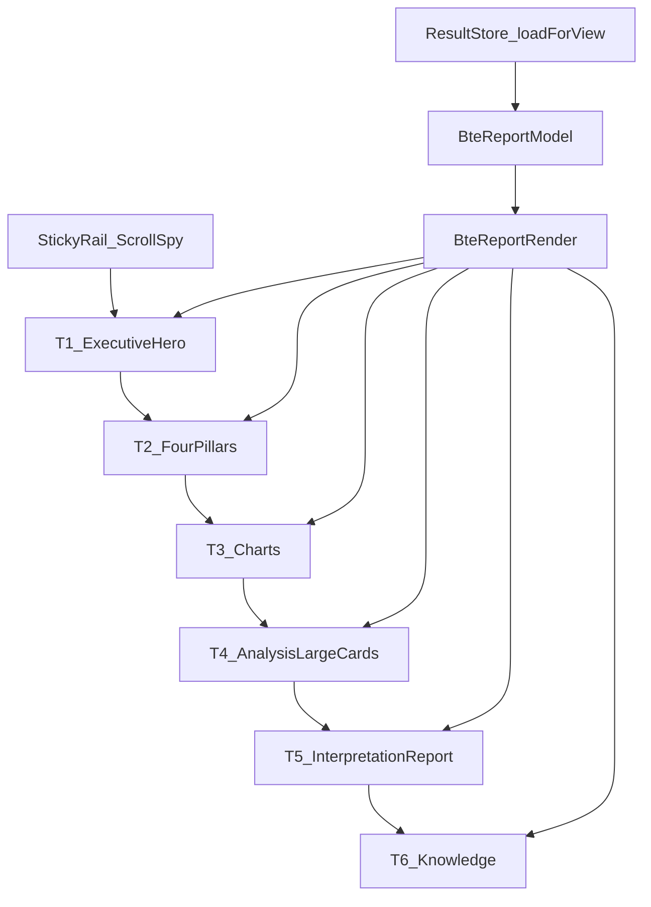
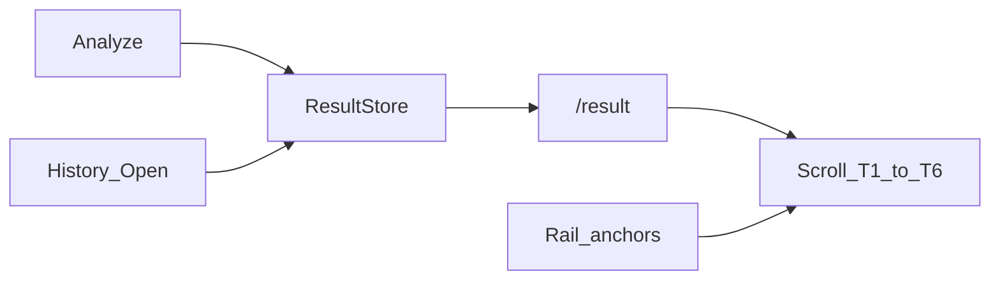

# Phase 2 — Commercial UX: Complete Result Information Architecture

**Date:** 2026-08-02  
**Surface:** Customer Portal `/result` only (presentation)  
**Status:** Complete

---

## 1. Before / After

| | Path |
|--|------|
| **Before (tabs / commercial polish)** | [`docs/reports/ui_commercial_preview/index.html`](../ui_commercial_preview/index.html) |
| **Earlier (UI v2 tabs)** | [`docs/reports/ui_v2_preview/index.html`](../ui_v2_preview/index.html) |
| **After (6-tier report)** | [`preview/after_report.html`](preview/after_report.html) |

Regenerate after:

```bash
node applications/customer_portal/tests/js/ui_phase2_preview_build.js
```

Screenshot note: open After HTML in a desktop browser; capture first viewport (Executive hero + rail) and a scrolled Analysis/Interpretation view for design review.

---

## 2. New layout list

1. **Report shell** — sticky left rail + main scroll column  
2. **T1 Executive Hero** — dominant summary card  
3. **T2 Four Pillars** — 4 large columns (not table)  
4. **T3 Charts** — radar / gauge / bars grid  
5. **T4 Analysis** — large collapsible topic cards  
6. **T5 Interpretation** — domain report cards  
7. **T6 Knowledge** — status + Knowledge Expert pane  

Stage tabs removed as primary navigation.

---

## 3. New component list

| Component | File |
|-----------|------|
| `BteReportIcons` | `static/js/report/icons.js` |
| `BteReportCharts` | `static/js/report/charts.js` |
| `BteReportModel` | `static/js/report/report_model.js` |
| `BteReportRender` | `static/js/report/report_render.js` |
| `BteScrollSpy` | `static/js/ui/scroll_spy.js` |
| Report CSS | `static/css/report.css` |
| Tier registry | `static/js/ui/module_registry.js` (retargeted) |

Reused: `summary_builder.js`, `discussion.js`, `interpretation.js` chapter mapping, ResultStore.

---

## 4. Information Architecture Diagram



---

## 5. UX Flow



User is guided top-down; rail + scroll-spy prevent “hunting across tabs.”

---

## 6. Rationale per change

| Change | Why |
|--------|-----|
| Drop primary tabs | Tabs equalize everything into a database viewer |
| Executive hero first | Instant “this is an analysis result” signal |
| Four pillar columns | Chart identity as visual product, not spreadsheet |
| SVG charts | Structure readable at a glance without npm |
| Large analysis cards | Hierarchy: important topics get mass |
| Interpretation as report chapters | Story / domains, not a wall of text |
| Knowledge last | Sources & expert after conclusions |
| Sticky rail + scroll-spy | Forced reading order with optional jump |
| Unavailable blocks | Honest UX when Hợp/Xung/etc. absent — no fabrication |
| Neutral palette + selective accent | Highlights only Nhật Chủ / Dụng / Hỷ / Kỵ / Thân |

---

## 7. Freeze confirmation

| Area | Changed? |
|------|----------|
| `engines/` | **No** |
| `database/` | **No** |
| `applications/api/` | **No** |
| Rule / Pattern / Knowledge / Interpretation / Score engines | **No** |
| ResultStore keys / `loadForView` | **Preserved** |
| `_layout.html` script order (`result_store` before `api`) | **Preserved** |

---

## Tests

```text
python -m pytest applications/customer_portal/tests -q
```

Expected: portal suite green (ResultStore + layout order).

Lint/Typecheck: **N/A** (no portal ESLint/tsc).
