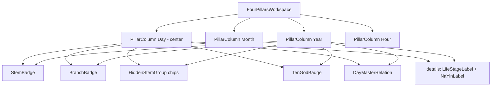

# UI Sprint 02 — Four Pillars Workspace Handover

| Field | Value |
|-------|--------|
| **Sprint** | UI Sprint 02 — Tier 2 Four Pillars |
| **Blueprint** | V1.1 Final Freeze |
| **Date** | 2026-08-02 |
| **Scope** | Tier 2 only |

---

## 1. Screenshots

| Theme | File |
|-------|------|
| Desktop Light | [preview/screenshot_desktop_light.png](preview/screenshot_desktop_light.png) |
| Desktop Dark | [preview/screenshot_desktop_dark.png](preview/screenshot_desktop_dark.png) |
| HTML Light | [preview/pillars_light.html](preview/pillars_light.html) |
| HTML Dark | [preview/pillars_dark.html](preview/pillars_dark.html) |

Rebuild: `node applications/customer_portal/tests/js/ui_sprint02_pillars_preview_build.js`

---

## 2. Component diagram

New module: `applications/customer_portal/static/js/report/pillars.js` (`BtePillars`).

| Component | Responsibility |
|-----------|----------------|
| FourPillarsWorkspace | 4-column model layout (no table) |
| PillarColumn | Independent pillar entity |
| StemBadge | Thiên Can — largest type |
| BranchBadge | Địa Chi — secondary to stem |
| HiddenStemGroup | Tàng Can as chips |
| TenGodBadge | Unified badge style |
| DayMasterRelation | Role / relation via payload thập thần (no invention) |
| LifeStageLabel | Trường Sinh as status |
| NaYinLabel | Nạp Âm as metadata |

---

## 3. Binding map (`18_BINDING_INDEX`)

| Slot | Binding |
|------|---------|
| `pillar.{p}.stem` | SummaryBuilder pillar stem |
| `pillar.{p}.branch` | branch |
| `pillar.{p}.hidden` / `hidden_list` | tang_can / hidden_stems → chips |
| `pillar.{p}.ten_god` / `ten_god_list` | ten_god → badges |
| `pillar.{p}.chang_sheng` | truong_sinh |
| `pillar.{p}.nap_am` | nap_am |
| `pillar.day.is_day` | index === day → visual center |
| Relation | **Only** thập thần from payload (Day = Nhật Chủ label). No fabricated relations. |

Missing → `report.unavailable` / dashed chips — never `null`, `undefined`, or raw i18n keys.

---

## 4. Accessibility

- Workspace `role="group"` + aria-label Bát Tự  
- Each column `tabindex="0"` + aria-label (Ngày includes Nhật Chủ)  
- Focus-visible ring on columns  
- Enter/Space toggles meta `
` when focus is on column  
- Tooltips via `title` on stem/branch/chips/badges  
- Chips `role="list"` / `listitem`

---

## 5. Performance

- New JS module is presentational string templates only  
- No API / engine calls  
- CSS scoped under `.fp-*`

---

## 6. Scope confirmation

| Layer | Changed? |
|-------|----------|
| Backend / API / Engine / Database | **No** |
| Tier 1 Hero | **No intentional change this sprint** (Hero remains Sprint 01) |
| Tier 3–6 | **No** |
| Navigation / Reading Flow | **No** |
| Tier 2 | **Yes** |

---

## 7. Files changed

- `applications/customer_portal/static/js/report/pillars.js` **(new)**  
- `applications/customer_portal/static/js/report/report_model.js` (pillar view-model fields only)  
- `applications/customer_portal/static/js/report/report_render.js` (`renderPillars` + bind)  
- `applications/customer_portal/static/css/report.css` (`.fp-*`)  
- `applications/customer_portal/static/i18n/vi.json` (`bazi.workspace_hint`, relation labels, …)  
- `applications/customer_portal/templates/result.html` (script include)  
- `applications/customer_portal/tests/js/ui_sprint02_pillars_preview_build.js`  
- `docs/reports/ui_sprint02_four_pillars/**`

---

## 8. Tests

`python -m pytest applications/customer_portal/tests -q` → **18 passed**

---

## 9. PASS check

- [x] Not a table / spreadsheet  
- [x] Four independent columns Năm · Tháng · Ngày · Giờ  
- [x] Can > Chi hierarchy  
- [x] Day pillar visual center  
- [x] Tàng Can chips; Thập Thần badges; Nạp Âm metadata; Trường Sinh status  
- [x] Hover / focus / tooltip / expand-collapse (details)  
- [x] Empty + i18n contracts  

**Verdict:** Sprint 02 Four Pillars Workspace **PASS**.
