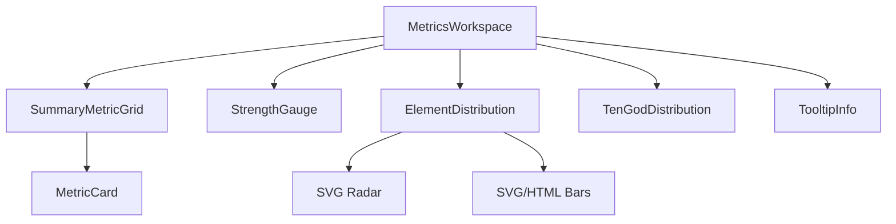

# UI Sprint 03 — Metrics & Visual Analytics Handover

| Field | Value |
|-------|--------|
| **Sprint** | UI Sprint 03 — Tier 3 |
| **Blueprint** | V1.1 Final Freeze |
| **Date** | 2026-08-02 |
| **Scope** | Tier 3 only |

---

## 1. Screenshots

| Theme | File |
|-------|------|
| Desktop Light | [preview/screenshot_desktop_light.png](preview/screenshot_desktop_light.png) |
| Desktop Dark | [preview/screenshot_desktop_dark.png](preview/screenshot_desktop_dark.png) |
| HTML | [preview/metrics_light.html](preview/metrics_light.html) / [metrics_dark.html](preview/metrics_dark.html) |

Rebuild: `node applications/customer_portal/tests/js/ui_sprint03_metrics_preview_build.js`

---

## 2. Component diagram

Module: `applications/customer_portal/static/js/report/metrics.js` (`BteMetrics`)  
SVG helpers: `charts.js` (a11y enhancement only)

**Frozen order:** Metrics → Gauge → Element (Radar + Distribution) → Ten Gods

---

## 3. Binding map

| Slot | Binding | Missing |
|------|---------|---------|
| Summary metrics Thân | pattern/overview than label | Unavailable |
| Summary metrics Quality | score grade/total/overall | Unavailable |
| Summary metrics wuxing_score | score.wuxing_score if present | omit card |
| Summary metrics strength_score | score.strength_score if present | omit card |
| Gauge | numeric strength_score only | text than + gauge_text_only |
| Element series | score wuxing series → else pillar counts (display) | ChartEmpty |
| Ten gods | score ten-god series → else pillar frequency | ChartEmpty |
| Short insight | interpretation.sections matching theme only | caption “chưa có mô tả…” |

**Not bound / not shown:** Đại Vận, Lưu Niên/Tháng/Ngày/Giờ.

---

## 4. Accessibility report

- Panels `tabindex="0"` + `aria-label`  
- SVG `role="img"` + descriptive `aria-label` (values, not color-only)  
- Bars `role="list"` + `title` tooltips  
- TooltipInfo buttons keyboard-focusable  
- Visually-hidden text alternative under each panel  
- Insight/source captions in text (not color alone)

---

## 5. Performance report

- Pure SVG / CSS bars — **no chart library**  
- Presentational templates; no extra network  
- No re-render loop; Result boot builds model once  
- CSS scoped `.mx-*`

---

## 6. Design compliance checklist

- [x] Blueprint V1.1 Tier 3 order  
- [x] Visual Grammar (primary accent, no red flood, calm motion)  
- [x] Binding Index  
- [x] Empty / Unavailable contract  
- [x] Localization contract (no raw keys)  
- [x] Component hierarchy (Tier 3 only)  
- [x] No Tier 1/2/4/5/6 structural edits  

---

## 7. Scope confirmation

| Layer | Changed? |
|-------|----------|
| Backend / API / Engine / Database | **No** |
| Tier 1 / Tier 2 | **No** |
| Navigation / Reading Flow | **No** |
| Tier 3 | **Yes** |

---

## 8. Files changed

- `applications/customer_portal/static/js/report/metrics.js` **(new)**  
- `applications/customer_portal/static/js/report/charts.js` (a11y)  
- `applications/customer_portal/static/js/report/report_model.js` (charts view-model enrich)  
- `applications/customer_portal/static/js/report/report_render.js` (`renderCharts` → BteMetrics)  
- `applications/customer_portal/static/css/report.css` (`.mx-*`)  
- `applications/customer_portal/static/i18n/vi.json`  
- `applications/customer_portal/templates/result.html` (script include)  
- `applications/customer_portal/tests/js/ui_sprint03_metrics_preview_build.js`  
- `docs/reports/ui_sprint03_metrics/**`

---

## 9. Tests

`python -m pytest applications/customer_portal/tests -q` → **18 passed**

---

## 10. PASS

Tier 3 delivers insight-first metrics (balance, thân, thập thần, nổi bật) before Analysis/Interpretation; charts are support, not a technical chart dump.

**Verdict:** Sprint 03 **PASS**.
