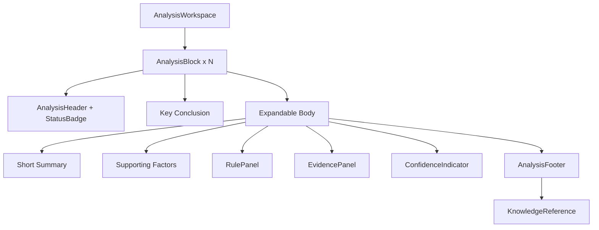

# UI Sprint 04 — Explainable Analysis Workspace Handover

| Field | Value |
|-------|--------|
| **Sprint** | UI Sprint 04 — Tier 4 |
| **Blueprint** | V1.1 Final Freeze |
| **Date** | 2026-08-02 |
| **Scope** | Tier 4 only |

---

## 1. Screenshots

| Theme | File |
|-------|------|
| Desktop Light | [preview/screenshot_desktop_light.png](preview/screenshot_desktop_light.png) |
| Desktop Dark | [preview/screenshot_desktop_dark.png](preview/screenshot_desktop_dark.png) |
| HTML | [preview/analysis_light.html](preview/analysis_light.html) |

Rebuild: `node applications/customer_portal/tests/js/ui_sprint04_analysis_preview_build.js`

---

## 2. Component diagram

Module: `applications/customer_portal/static/js/report/analysis.js` (`BteAnalysis`)

---

## 3. Reading order (frozen per block)

1. Kết luận  
2. Giải thích ngắn  
3. Các yếu tố ảnh hưởng  
4. Rule được áp dụng  
5. Bằng chứng  
6. Độ tin cậy  
7. Liên kết Knowledge  

---

## 4. Binding map

| Block | Conclusion source | Rules / Evidence / Confidence |
|-------|-------------------|-------------------------------|
| Ngũ hành | element series factors | pattern/score containers if present |
| Thập thần | ten-god series | same |
| Cách cục | cach_cuc (+ tong_cach) | pattern.rules / evidence |
| Thân vượng | than label | scoped containers |
| Dụng / Hỷ / Kỵ | overview fields | useful_god containers |
| Hợp…Phá | relations payload keys | Unavailable if absent |
| Thần sát | shensha names | scoped |
| Priority · Knowledge | knowledge_expert status / priority_rules text only | no invented essays |

Missing slots → `report.unavailable`. No engine class names. No AI rewrite.

---

## 5. Accessibility

- Expand/collapse button `aria-expanded`  
- Large independent blocks (not mini-card grid)  
- Knowledge link to `#tier-knowledge`  
- Status badge text (not color-only)

---

## 6. Performance

- Presentational templates only  
- No new dependencies  
- Collapse hides body via CSS (`data-collapsed`)

---

## 7. Scope confirmation

| Layer | Changed? |
|-------|----------|
| Backend / API / Engine / Database | **No** |
| Tier 1 / 2 / 3 / 5 / 6 | **No** |
| Navigation / Reading Flow | **No** |
| Tier 4 | **Yes** |

---

## 8. Files changed

- `applications/customer_portal/static/js/report/analysis.js` **(new)**  
- `applications/customer_portal/static/js/report/report_model.js` (`analysis.blocks`)  
- `applications/customer_portal/static/js/report/report_render.js` (`renderAnalysis` + bind)  
- `applications/customer_portal/static/css/report.css` (`.ax-*`)  
- `applications/customer_portal/static/i18n/vi.json`  
- `applications/customer_portal/templates/result.html`  
- `applications/customer_portal/tests/js/ui_sprint04_analysis_preview_build.js`  
- `docs/reports/ui_sprint04_analysis/**`

---

## 9. Tests

`python -m pytest applications/customer_portal/tests -q` → **18 passed**

---

## 10. PASS

Tier 4 is an Explainable Analysis Workspace: each conclusion follows the required structure; content is payload-bound only.

**Verdict:** Sprint 04 **PASS**.
