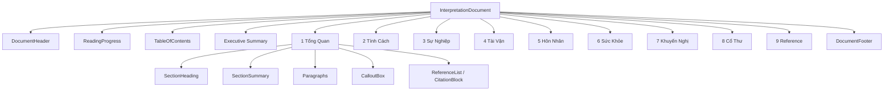

# UI Sprint 05 — Interpretation Document Experience Handover

| Field | Value |
|-------|--------|
| **Sprint** | UI Sprint 05 — Tier 5 |
| **Blueprint** | V1.1 Final Freeze |
| **Date** | 2026-08-02 |
| **Scope** | Tier 5 only |

---

## 1. Screenshots

| Theme | File |
|-------|------|
| Desktop Light | [preview/screenshot_desktop_light.png](preview/screenshot_desktop_light.png) |
| Desktop Dark | [preview/screenshot_desktop_dark.png](preview/screenshot_desktop_dark.png) |
| HTML | [preview/interpretation_light.html](preview/interpretation_light.html) |

Rebuild: `node applications/customer_portal/tests/js/ui_sprint05_interpretation_preview_build.js`

---

## 2. Document structure diagram

---

## 3. Component diagram

Module: `applications/customer_portal/static/js/report/interpretation_doc.js` (`BteInterpretationDoc`)

| Component | Role |
|-----------|------|
| InterpretationDocument | Document root |
| DocumentHeader | Title + confidence |
| TableOfContents | Clickable TOC + active chapter |
| ReadingProgress | Sticky read bar |
| DocumentSection | Chapter (not card) |
| SectionHeading / SectionSummary | H2 hierarchy |
| CalloutBox | Insight / caution only |
| CitationBlock / ReferenceList | End-of-chapter refs |
| DocumentFooter | Knowledge affordance |

**Not used as primary unit:** `rpt-large-card` / dashboard cards.

---

## 4. Binding map

| Slot | Binding |
|------|---------|
| Header confidence | `interpretation.confidence` |
| TOC | derived; shown when ≥2 chapters |
| Executive Summary | overview/highlights section |
| Ch.1 overview | overview, summary, tong_quan, highlights |
| Ch.2 personality | personality, tinh_cach, … |
| Ch.3–6 | career / wealth / marriage / health |
| Ch.7 advice | conclusion, recommendations, … |
| Ch.8 classical | classical, co_thu, books, … |
| Ch.9 references | section + `interpretation.references` |
| Callout | section.callout/insight/caution only (advice may use first sentence of payload body) |
| Citations | section citations/references/evidence |

Missing body → title visible + Unavailable. No AI rewrite.

---

## 5. Accessibility

- TOC `nav` + aria-label  
- Chapters `aria-labelledby`  
- TOC keyboard links + smooth scroll  
- IntersectionObserver marks active chapter  
- Callout `role="note"`  
- Reading progress decorative (`aria-hidden`)

---

## 6. Performance

- No new chart libraries  
- Local TOC spy only inside document  
- Presentational templates; single model build

---

## 7. Design compliance

- [x] Blueprint V1.1 document model  
- [x] Visual Grammar (reading typography, scarce callouts)  
- [x] Binding Index  
- [x] Empty / Unavailable  
- [x] Localization  
- [x] Component hierarchy (Tier 5 only)  

---

## 8. Scope confirmation

| Layer | Changed? |
|-------|----------|
| Backend / API / Engine / Database | **No** |
| Tier 1–4 / Tier 6 | **No** |
| Navigation / Reading Flow (global) | **No** |
| Tier 5 | **Yes** |

---

## 9. Files changed

- `applications/customer_portal/static/js/report/interpretation_doc.js` **(new)**  
- `applications/customer_portal/static/js/report/report_model.js` (document view-model)  
- `applications/customer_portal/static/js/report/report_render.js` (`renderInterpretation` + bind)  
- `applications/customer_portal/static/css/report.css` (`.idoc-*`)  
- `applications/customer_portal/static/i18n/vi.json`  
- `applications/customer_portal/templates/result.html`  
- `applications/customer_portal/tests/js/ui_sprint05_interpretation_preview_build.js`  
- `docs/reports/ui_sprint05_interpretation/**`

---

## 10. Tests

`python -m pytest applications/customer_portal/tests -q` → **18 passed**

---

## 11. PASS

Tier 5 is a professional advisory **document** with TOC, numbered chapters, readable typography, callouts, and references — not a dashboard.

**Verdict:** Sprint 05 **PASS**.
