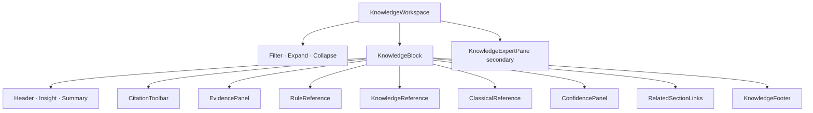

# UI Sprint 06 — Knowledge & Evidence Workspace Handover

| Field | Value |
|-------|--------|
| **Sprint** | UI Sprint 06 — Tier 6 |
| **Blueprint** | V1.1 Final Freeze |
| **Date** | 2026-08-02 |
| **Scope** | Tier 6 only |

---

## 1. Screenshots

| Theme | File |
|-------|------|
| Desktop Light | [preview/screenshot_desktop_light.png](preview/screenshot_desktop_light.png) |
| Desktop Dark | [preview/screenshot_desktop_dark.png](preview/screenshot_desktop_dark.png) |
| HTML | [preview/knowledge_light.html](preview/knowledge_light.html) |

Rebuild: `node applications/customer_portal/tests/js/ui_sprint06_knowledge_preview_build.js`

---

## 2. Knowledge Workspace diagram



Frozen order per block:

Insight → Evidence → Applied Rule → Knowledge → Classical Reference → Confidence → Related Sections

---

## 3. Component diagram

Module: `applications/customer_portal/static/js/report/knowledge_workspace.js` (`BteKnowledge`)

| Component | Role |
|-----------|------|
| KnowledgeWorkspace | Workspace root + filter/expand controls |
| KnowledgeBlock | Traceable insight unit |
| EvidencePanel | Evidence / reason / condition |
| RuleReference | Rule name · category · priority · description |
| KnowledgeReference | Knowledge citation text |
| ClassicalReference | Book · thiên · chương · đoạn · quote |
| ConfidencePanel | Payload confidence only |
| RelatedSectionLinks | Links to Analysis / Interpretation when payload provides |
| CitationToolbar | Copy citation / copy rule |
| KnowledgeFooter | Traceability note |

Expert discussion pane remains secondary under the workspace (Blueprint L6).

---

## 4. Binding map

| Slot | Binding |
|------|---------|
| Blocks | `knowledge_blocks` · `knowledge.blocks/insights` · `knowledge_expert.blocks` · `evidence_trace` |
| Pattern trace | `pattern.rules` / `evidence` / `classical` / `confidence` when present |
| Status fallback | `knowledge_expert` status fields only — no invented essay |
| Evidence rows | label · reason · condition · source_type · reference |
| Rules | display_name/name only — hide bare engine ids |
| Classical | book · chapter · section · passage · quote |
| Confidence | payload only |
| Related | `related_sections` with type analysis/interpretation + id |
| Expert | existing discussion presenter + `/api/v1/discussion` |

Missing fields → Unavailable. No invented classical books, confidence, or links.

---

## 5. Accessibility

- Filter labeled (`label` + `for`)
- Expand/collapse buttons with `aria-expanded`
- Search region `role="search"`
- Related links are real anchors (`#analysis-*` / `#interp-*`) when payload provides targets
- Section headings hierarchy inside each block

---

## 6. Performance

- No new chart libraries
- Client-side filter only (string match on block text)
- Presentational templates; single model build
- Copy uses Clipboard API with silent fallback

---

## 7. Design compliance

- [x] Blueprint V1.1 Knowledge evidence model (Addendum C)
- [x] Visual Grammar
- [x] Binding Index §6
- [x] Empty / Unavailable
- [x] Localization (`report.kw_*`)
- [x] Component hierarchy (Tier 6 only)

---

## 8. Confirmations

| Constraint | Status |
|------------|--------|
| No Backend / API / Engine / Database changes | **Confirmed** |
| No Tier 1–5 structural rewrites | **Confirmed** |
| No Navigation / Reading Flow change | **Confirmed** |
| No invented evidence / classical / confidence | **Confirmed** |

### Files touched

- `applications/customer_portal/static/js/report/knowledge_workspace.js` **(new)**
- `applications/customer_portal/static/js/report/report_model.js` (knowledge workspace binding)
- `applications/customer_portal/static/js/report/report_render.js` (Tier 6 render + bind)
- `applications/customer_portal/static/js/result.js` (pass model into bind for copy)
- `applications/customer_portal/templates/result.html` (script tag)
- `applications/customer_portal/static/css/report.css` (`.kw-*`)
- `applications/customer_portal/static/i18n/vi.json` (`report.kw_*`)
- `applications/customer_portal/tests/js/ui_sprint06_knowledge_preview_build.js` **(new)**
- `docs/reports/ui_sprint06_knowledge/**` (handover + preview)

### Tests

```
python -m pytest applications/customer_portal/tests -q
→ 18 passed
```

Preview assert failures: none.

---

## PASS criteria

User can trace each conclusion:

**Insight → Evidence → Rule → Knowledge → Classical Reference**

without seeing internal engine structure. Knowledge Workspace embodies **Explainable & Traceable Analysis**.
