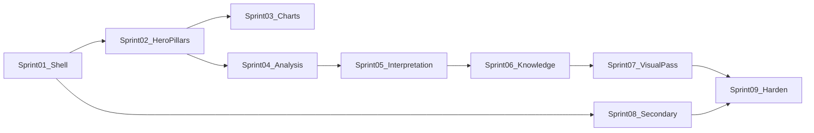

# IMPLEMENTATION PLAN — After Blueprint Approval

| Field | Value |
|-------|--------|
| **Document** | `IMPLEMENTATION_PLAN.md` |
| **Version** | `1.1.0` |
| **Status** | Final Freeze — **execution gated on PO Final PASS** |
| **SSOT** | [19_BLUEPRINT_V1_1_FINAL_FREEZE.md](19_BLUEPRINT_V1_1_FINAL_FREEZE.md) |

---

## Gate

**Do not implement frontend until PO signs [14_ACCEPTANCE_CRITERIA.md](14_ACCEPTANCE_CRITERIA.md).**

Until unlock:

- No new UI code  
- No CSS/theme/layout/router/component work justified by “quick fix”  
- Prior Phase 2/3 UI may remain in tree but is **not** the SSOT; Blueprint V1.1 is SSOT  

After unlock, UI sprints **must not** change Information Architecture, Navigation, Reading Flow, Component Hierarchy, or Design Language.

---

## Sprint sizing rule

Each UI Sprint ≤ **2 working days**.  
Each sprint delivers a **vertical slice** of the approved IA — not a drive-by restyle.

Freeze remains: no engines / API / database / business logic changes unless a separate milestone says so.

---

## UI Sprint 01 — Result spine shell (Day 1–2)

**Goal:** Mount Result as report stream + sticky rail + anchors + scroll spy + skeleton/empty.

| Deliver | Map to blueprint |
|---------|------------------|
| ResultPage shell | WIREFRAME global frame |
| NavigationRail + ScrollSpy + ReadingProgress | NAVIGATION_SPEC |
| Tier placeholders 1–6 with titles only | HOME_RESULT_ARCHITECTURE order |
| Empty state | USER_READING_FLOW Moment 0 |

**Exit criteria:** Scroll order fixed; no primary tabs; deep link `#tier-*` works.

---

## UI Sprint 02 — Executive Hero + Pillars (Day 1–2)

**Goal:** VH1 + VH2 real content from existing payload/summary builder.

| Deliver | Components |
|---------|------------|
| ExecutiveHero, DayMasterDisplay, QualityVerdictCaption, FirstRecommendation, SummaryMetric, StrengthWeaknessPanel | COMPONENT_MAP + Addendum A |
| PillarGrid, PillarColumn | WIREFRAME Tier 2 |
| Bindings only from Binding Index | [18_BINDING_INDEX.md](18_BINDING_INDEX.md) |
| Accent rules for Day/Dụng/Hỷ/Kỵ/Thân | VISUAL_HIERARCHY |

**Exit criteria:** First viewport passes Insight First stranger test; no invented fields; missing → Unavailable per [16](16_EMPTY_UNAVAILABLE_STATES.md).

---

## UI Sprint 03 — Charts band (Day 1–2)

**Goal:** Element radar, strength gauge (numeric only), distribution + ten-god bars; ChartEmpty honesty.

**Exit criteria:** Charts support narrative; text fallback when gauge number absent.

---

## UI Sprint 04 — Analysis large sections (Day 1–2)

**Goal:** AnalysisStack with Ngũ hành, Thập thần, Cách cục, Dụng/Hỷ/Kỵ, Relations Unavailable matrix, Thần sát, Knowledge status.

**Exit criteria:** Large cards only; collapse for secondary; no mini-card carpet.

---

## UI Sprint 05 — Interpretation document (Day 1–2)

**Goal:** InterpretationDocument + TOC (if ≥2 chapters) + H2 chapters + optional callout/refs (Addendum B); chapters mapped from Binding Index.

**Exit criteria:** Document hierarchy; empty chapters Unavailable.

---

## UI Sprint 06 — Knowledge Expert tier (Day 1–2)

**Goal:** Evidence panel + 3-pane expert consuming existing discussion API; narrative fallback; ErrorPanel/Retry.

**Exit criteria:** Expert is last; does not replace hero; failures honest.

---

## UI Sprint 07 — Visual language pass (Day 1–2)

**Goal:** Align type scale, spacing, elevation, motion, accent scarcity to VISUAL_HIERARCHY + DESIGN_LANGUAGE + [15_VISUAL_GRAMMAR.md](15_VISUAL_GRAMMAR.md) — **after** structure exists.

**Exit criteria:** Pass Design QA questions; stay inside Visual Grammar bands; still not an admin dashboard.

---

## UI Sprint 08 — Secondary screens align (Day 1–2)

**Goal:** Dashboard / Analyze / Reports / History / Login chrome aligned to SCREEN_BLUEPRINT priorities (intake & export only — no competing Result IA).

**Exit criteria:** CTAs lead correctly into Result spine.

---

## UI Sprint 09 — Hardening & handover (Day 1–2)

**Goal:** Portal tests, preview snapshots under `docs/reports/`, accessibility pass on rail/headings, freeze confirmation.

**Exit criteria:** Pytest portal module green; blueprint checklist signed.

---

## Dependency order

---

## Explicitly deferred

- Mobile-first  
- React console redesign  
- Fabricating luck/relations data  
- New FastAPI routes for UI cosmetics  

---

## Approval checkbox

- [ ] Product approves Insight First + no tabs  
- [ ] Domain approves Unavailable honesty ([16](16_EMPTY_UNAVAILABLE_STATES.md))  
- [ ] Engineering accepts sprint slices ≤2 days  
- [ ] Localization contract accepted ([17](17_LOCALIZATION_CONTRACT.md))  
- [ ] Blueprint pack version `1.1.0` Final Freeze signed via [14](14_ACCEPTANCE_CRITERIA.md)  

**Only then** may UI Sprint 01 start.

---

## Version

`1.1.0`
