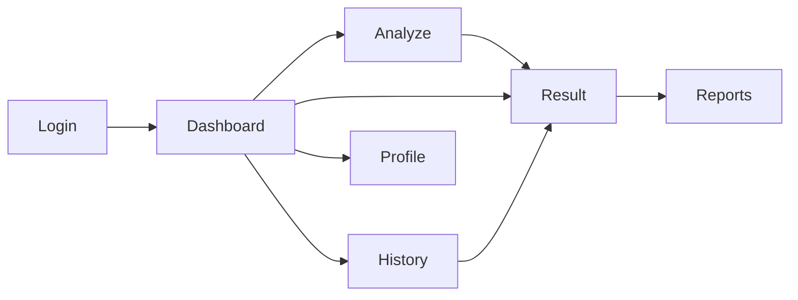

# SCREEN BLUEPRINT

| Field | Value |
|-------|--------|
| **Document** | `SCREEN_BLUEPRINT.md` |
| **Version** | `1.1.0` |
| **Status** | Final Freeze — Blueprint V1.1 |

---

## Purpose

Define **each major portal screen**: goal, role, audience, reading flow.  
Result is specified deeply in [HOME_RESULT_ARCHITECTURE.md](HOME_RESULT_ARCHITECTURE.md); this file places it in the product map.

**Addendum F (normative):** Analysis, Interpretation, and Knowledge Expert are **Result tiers**, not peer primary routes in V1.1. Section titles below keep product vocabulary; they do not authorize separate competing IAs.

---

## Product map

Knowledge Expert is a **tier inside Result** in V1 blueprint (not a separate primary route). A future dedicated Knowledge page may deep-link to the same IA.

---

## 1. Dashboard

| | |
|--|--|
| **Goal** | Orient; resume; start new analysis |
| **Role** | Home base — not the analysis itself |
| **Audience** | Returning customers |
| **Reading flow** | Greeting → Quick actions → Recent charts → Stats/health (secondary) |
| **Must not** | Duplicate full Result report; drown user in engine status tiles as “hero” |
| **Must never hide** | Primary CTA **Luận giải (Analyze)** |
| **Primary CTA** | Luận giải (Analyze) |

---

## 2. Result (Home of analysis)

| | |
|--|--|
| **Goal** | Deliver the professional BaZi analysis experience |
| **Role** | **Primary commercial screen** |
| **Audience** | Customer + practitioner |
| **Reading flow** | See [USER_READING_FLOW.md](USER_READING_FLOW.md) — Hero → Pillars → Charts → Analysis → Interpretation → Knowledge |
| **Must not** | Tabbed database viewer; equal card walls |
| **Primary CTA** | Read report; optional Expert ask; open Reports |

---

## 3. Analysis (as product concept)

In this blueprint, **Analysis is Tier 4 of Result**, not a separate peer app page.

| | |
|--|--|
| **Goal** | Thematic structural reading (elements, gods, pattern, useful gods, relations) |
| **Role** | Depth after identity + charts |
| **Audience** | Users who want “why the structure matters” |
| **Reading flow** | Enter via scroll or rail “Phân tích” → large sections top to bottom |
| **If a future `/analysis` route exists** | It must render the same Tier 4 IA (or redirect to `#tier-analysis`) — not invent a new module dashboard |

---

## 4. Interpretation

Interpretation is **Tier 5 of Result** — a **document** (Addendum B): TOC (if ≥2 chapters) → H2 chapters → optional callout / references.

| | |
|--|--|
| **Goal** | Domain narrative report |
| **Role** | “What it means for life domains” after facts |
| **Audience** | Customers seeking guidance |
| **Reading flow** | TOC → chapter heads → body → callouts/refs |
| **Must not** | Lead the entire Result page; bury Executive Summary; render as equal mini-cards without document hierarchy |

---

## 5. Knowledge Expert

Knowledge Expert is **Tier 6 of Result** (pane).

| | |
|--|--|
| **Goal** | Traceable Q&A grounded on evidence/knowledge/reasoning |
| **Role** | Trust & dialogue **after** the report spine |
| **Audience** | Curious / advanced users |
| **Reading flow** | Skim sources/status → ask → read answer/sources |
| **Must not** | Replace Executive Summary; invent citations; become homepage chat |

API: consume existing discussion endpoint only (implementation later).

---

## 6. Report (Reports Center)

**Addendum I — minimum topology:** List pane · Preview pane · Actions (open / print / copy / download) · Empty state.

| | |
|--|--|
| **Goal** | Preview, print, share, archive narrative/report outputs |
| **Role** | Distribution / archive — not first read |
| **Audience** | Users exporting or revisiting packages |
| **Reading flow** | Select item → preview → export actions |
| **Must not** | Become a second conflicting IA for the live Result story |
| **Alignment** | Page-1 of exports **must** follow Result spine order when composing documents |

---

## 7. Analyze

| | |
|--|--|
| **Goal** | Accurate birth input → produce Result |
| **Role** | Intake |
| **Reading flow** | Grouped sections: Personal → Place → Date → Time → Gender → Calendar/TZ → Submit |
| **Must not** | Show premature analysis widgets |

---

## 8. History / Profile / Login

| Screen | Goal | Role |
|--------|------|------|
| History | Re-open past charts | Library → Result |
| Profile | Account identity | Settings-lite |
| Login | Session | Gate |

Keep visually consistent with design language; never upgrade them above Result in product hierarchy.

---

## Priority of screens (commercial)

1. **Result**  
2. Analyze  
3. Reports  
4. Dashboard  
5. History  
6. Knowledge (as tier)  
7. Profile / Login  

Engineering effort in UI sprints after blueprint approval must respect this priority.

---

## Version

`1.1.0`
