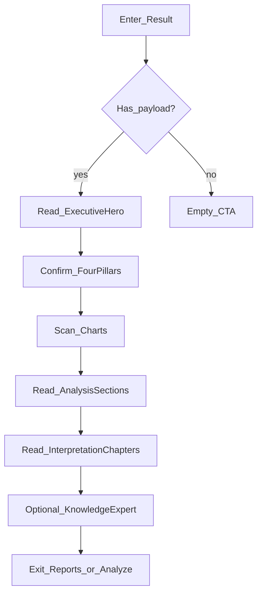

# USER READING FLOW — Result

| Field | Value |
|-------|--------|
| **Document** | `USER_READING_FLOW.md` |
| **Version** | `1.1.0` |
| **Status** | Final Freeze — Blueprint V1.1 |

---

## Purpose

Specify **exactly** what the user sees and does on Result so implementers do not leave users to guess.

Principle: **Insight First → Structure → Visual support → Analysis → Narrative → Evidence.**

---

## Moment 0 — Entry

**Trigger:** Analyze success redirect, or Open from Dashboard/History/Reports.

**System:** Load `ResultStore.loadForView()`. If empty → Empty state with CTA “Luận giải” (no fake report). See [16_EMPTY_UNAVAILABLE_STATES.md](16_EMPTY_UNAVAILABLE_STATES.md).

**User sees (≤200ms perceived):** Skeleton of rail + hero outline.

---

## Moment 1 — First look (0–3 seconds)

**Eyes land on:** Executive Summary Hero.

**Must be readable without scrolling (desktop):**

1. Nhật Chủ (largest)  
2. QualityVerdictCaption (calm)  
3. One summary sentence  
4. Thân · Dụng · Hỷ · Kỵ · Cách Cục · Quality row  
5. Strengths / Weaknesses (if present)  
6. **FirstRecommendation** (or Unavailable)  

**User should think:** “I know the chart’s core identity and the first guidance.”

**User should NOT need to:** Click a tab named Bát Tự / Score / Pattern.

---

## Moment 2 — Confirm identity (3–15 seconds)

**Action:** Scroll slightly or glance below hero.

**Sees:** Four Pillars — Day pillar highlighted.

**Job:** Confirm stems/branches match the spoken summary.

**Optional:** Click rail “Bát Tự” if they jumped away — lands on pillars.

---

## Moment 3 — Visual structure (15–40 seconds)

**Sees:** Charts band — radar, gauge (or text-only strength), element bars, ten-god bars.

**Job:** Feel imbalance / emphasis without reading paragraphs.

**Rule:** If a chart cannot bind data, show calm Unavailable / text fallback — do not invent numbers.

---

## Moment 4 — Thematic analysis (40–120 seconds)

**Sees:** Large Analysis sections stacked.

**Recommended path:**

1. Open/read Ngũ hành  
2. Thập thần  
3. Cách cục  
4. Dụng · Hỷ · Kỵ  
5. Skim relations / thần sát if curious (may stay collapsed)

**Interaction:** Expand/collapse is allowed; default for primary four sections = expanded (or first two expanded on smaller heights).

---

## Moment 5 — Domain narrative (2–5 minutes)

**Sees:** Interpretation **document** — TOC then H2 chapters.

**Recommended path:**

1. Scan TOC  
2. Điểm nổi bật  
3. Domain of interest  
4. Lời khuyên  

**Job:** Leave with actionable, non-absolute guidance.

---

## Moment 6 — Trust & dialogue (optional)

**Sees:** Knowledge tier — sources/status, then Expert pane.

**Actions:**

1. Skim confidence / status  
2. Ask Why / How / Evidence (existing discussion API)  
3. Read answer + sources panel  

**Exit paths:** Reports · New Analyze · History · Dashboard.

---

## Forced guidance (no guessing)

| If user wonders… | System answer |
|------------------|---------------|
| Where do I start? | Hero is start; rail labels order |
| Where is pattern? | Hero metric + Analysis “Cách cục” |
| Where is full text? | Tier Luận giải |
| Where is AI chat? | Tier Kiến thức only |
| Why is something missing? | Unavailable copy in place |

---

## Anti-patterns (fail reading flow)

| Anti-pattern | Why it fails |
|--------------|--------------|
| Six equal tabs | Forces hunting; kills story |
| Everything same card size | No insight first |
| Charts above Executive | Decoration before meaning |
| Expert chat as homepage | Conversation without grounding |
| Dumping all interpretation uncollapsed as one wall | Fatigue |

---

## Flow diagram

---

## Version

`1.1.0`
