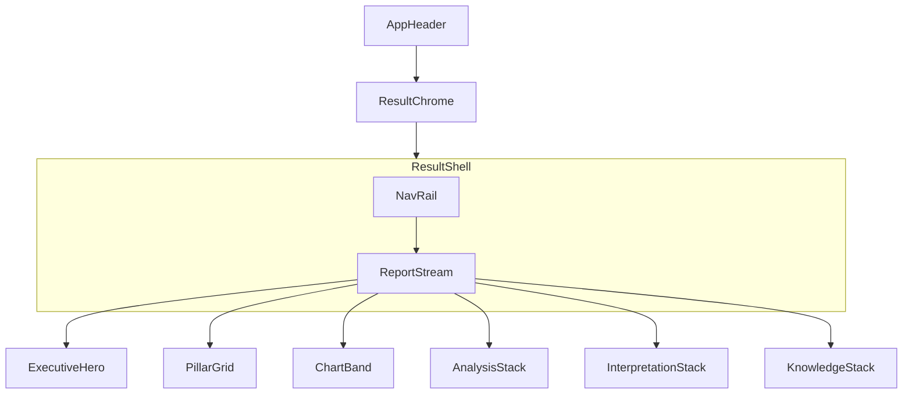

# WIREFRAME — Result (Desktop)

| Field | Value |
|-------|--------|
| **Document** | `WIREFRAME.md` |
| **Version** | `1.1.0` |
| **Status** | Final Freeze — Blueprint V1.1 |
| **Viewport** | Desktop / Laptop / Tablet (see Responsive matrix) |

---

## Purpose

Low-fidelity spatial layout for Result. No pixels, no CSS. Implementers must preserve **regions and proportions**, not invent a new topology.

---

## Global frame

```text
+======================================================================================+
| APP HEADER (global)                                                                   |
| Brand | Nav | Theme | User                                                            |
+======================================================================================+
| RESULT CHROME                                                                         |
| Title: Kết quả phân tích          [Reports] [New Analyze]                             |
| Meta: Ngày sinh · Giới tính                                                           |
+----------+---------------------------------------------------------------------------+
| NAV RAIL | REPORT STREAM (scroll)                                                    |
| sticky   |                                                                           |
|          |                                                                           |
| Tóm tắt  |  (tiers below)                                                            |
| Bát Tự   |                                                                           |
| Biểu đồ  |                                                                           |
| Phân tích|                                                                           |
| Luận giải|                                                                           |
| Kiến thức|                                                                           |
| -------- |                                                                           |
| Progress |                                                                           |
+----------+---------------------------------------------------------------------------+
```

**Proportions (desktop):** Rail ≈ 200–240px fixed; Stream fills remainder. Stream max content width ≈ 960–1100px for reading comfort (centered within column).

---

## Tier 1 — Executive Summary (Hero)

```text
+--------------------------------------------------------------------------+
| EXECUTIVE SUMMARY / Tóm tắt                          [eyebrow]            |
|                                                                          |
|   ((◉))  NHẬT CHỦ                                          LARGE         |
|          Canh · Kim · Dương                                              |
|                                                                          |
|   QualityVerdictCaption (calm band — or Unavailable)                     |
|                                                                          |
|   One summary sentence (body, max ~3 lines)                              |
|                                                                          |
|  +--------+ +--------+ +--------+ +--------+ +--------+ +--------+       |
|  | Thân   | | Dụng   | | Hỷ     | | Kỵ     | | Cách   | | Quality|       |
|  | MEDIUM | | ACCENT | | ACCENT | | ACCENT | | Cục    | |        |       |
|  +--------+ +--------+ +--------+ +--------+ +--------+ +--------+       |
|                                                                          |
|  +---------------------------+  +---------------------------+            |
|  | Điểm mạnh                 |  | Điểm yếu                  |            |
|  | • …                       |  | • …                       |            |
|  +---------------------------+  +---------------------------+            |
|                                                                          |
|  +-- Khuyến nghị đầu tiên (callout) ----------------------------------+ |
|  | one sentence OR Unavailable                                         | |
|  +---------------------------------------------------------------------+ |
+--------------------------------------------------------------------------+
```

**First viewport rule:** Hero occupies majority of first screen; pillars may peek below but must not steal L1.

---

## Tier 2 — Four Pillars

```text
+--------------------------------------------------------------------------+
| BÁT TỰ                                                                    |
|                                                                          |
|  +-------------+ +-------------+ +================+ +-------------+     |
|  | NĂM         | | THÁNG       | || NGÀY (DAY)   || | GIỜ         |     |
|  |             | |             | ||  HIGHLIGHT   || |             |     |
|  |  CAN        | |  CAN        | ||  CAN         || |  CAN        |     |
|  |  CHI        | |  CHI        | ||  CHI         || |  CHI        |     |
|  |  Tàng Can   | |  Tàng Can   | ||  Tàng Can    || |  Tàng Can   |     |
|  |  Thập Thần  | |  Thập Thần  | ||  Thập Thần   || |  Thập Thần  |     |
|  |  Trường Sinh| |  Trường Sinh| ||  Trường Sinh || |  Trường Sinh|     |
|  |  Nạp Âm     | |  Nạp Âm     | ||  Nạp Âm      || |  Nạp Âm     |     |
|  +-------------+ +-------------+ +================+ +-------------+     |
+--------------------------------------------------------------------------+
```

Not a table. Four equal columns; Day column visually stronger.

---

## Tier 3 — Charts

```text
+--------------------------------------------------------------------------+
| BIỂU ĐỒ                                                                   |
|  +---------------------------+  +---------------------------+            |
|  | Radar Ngũ hành            |  | Gauge Thân                |            |
|  |        /\                 |  |      (  68  )             |            |
|  |      /    \               |  |   or text-only if no score|            |
|  +---------------------------+  +---------------------------+            |
|  +---------------------------+  +---------------------------+            |
|  | Bars Ngũ hành            |  | Bars Thập thần           |            |
|  | Mộc ████                  |  | Tỷ Kiên ██                |            |
|  | Hỏa ██                    |  | …                         |            |
|  +---------------------------+  +---------------------------+            |
+--------------------------------------------------------------------------+
```

---

## Tier 4 — Analysis (stacked large sections)

```text
+--------------------------------------------------------------------------+
| PHÂN TÍCH                                                                 |
|                                                                          |
| +----------------------------------------------------------------------+ |
| | NGŨ HÀNH                                              [collapse ▾]   | |
| | (large body — distribution + short explain)                          | |
| +----------------------------------------------------------------------+ |
| | THẬP THẦN                                             [collapse ▾]   | |
| +----------------------------------------------------------------------+ |
| | CÁCH CỤC                                              [collapse ▾]   | |
| +----------------------------------------------------------------------+ |
| | DỤNG · HỶ · KỴ                                        [collapse ▾]   | |
| +----------------------------------------------------------------------+ |
| | HỢP · XUNG · HÌNH · HẠI · PHÁ                         [collapse ▾]   | |
| | Unavailable rows if payload lacks fields                             | |
| +----------------------------------------------------------------------+ |
| | THẦN SÁT                                              [collapse ▾]   | |
| +----------------------------------------------------------------------+ |
| | PRIORITY · KNOWLEDGE STATUS                           [collapse ▾]   | |
| +----------------------------------------------------------------------+ |
+--------------------------------------------------------------------------+
```

**Forbidden:** 12+ equal mini-cards in one dense grid competing for attention.

---

## Tier 5 — Interpretation (document)

```text
+--------------------------------------------------------------------------+
| LUẬN GIẢI                                                                 |
| Confidence caption (if present)                                           |
|                                                                          |
| MỤC LỤC (TOC) — required if ≥2 chapters available                         |
|  1. Điểm nổi bật  2. Sự nghiệp  …  7. Lời khuyên                          |
|                                                                          |
| ## Điểm nổi bật (H2)                                                      |
| | body OR Unavailable | optional Callout | optional References           |
| ## Sự nghiệp …                                                            |
| ## Tài vận …                                                              |
| ## Hôn nhân …                                                             |
| ## Sức khỏe …                                                             |
| ## Tính cách …                                                            |
| ## Lời khuyên …                                                           |
+--------------------------------------------------------------------------+
```

---

## Tier 6 — Classical Knowledge

```text
+--------------------------------------------------------------------------+
| KIẾN THỨC                                                                 |
|                                                                          |
| +-- Nguồn · Citation · Confidence -------------------------------------+ |
| | status / evidence panel (honest empty if absent)                     | |
| +----------------------------------------------------------------------+ |
|                                                                          |
| +-- AI Knowledge Expert -----------------------------------------------+ |
| | +------------+ +---------------------+ +----------------+            | |
| | | Conversation| | Answer             | | Sources        |            | |
| | |            | |                     | | Confidence     |            | |
| | | [ask....]  | |                     | |                |            | |
| | +------------+ +---------------------+ +----------------+            | |
| | Narrative fallback (collapsed details) optional                      | |
| +----------------------------------------------------------------------+ |
+--------------------------------------------------------------------------+
```

---

## Mermaid — region graph



---

## Responsive matrix (Addendum G)

| Band | Width | Behavior |
|------|-------|----------|
| Desktop | ≥1280 | Sticky left NavigationRail; 4 pillars; 2×2 charts |
| Laptop | 1100–1279 | Same topology; tighter padding |
| Tablet | <1100 | Horizontal chip rail; pillars 2×2→1×4; charts stack |
| Mobile | — | Out of scope |

## Version

`1.1.0`
