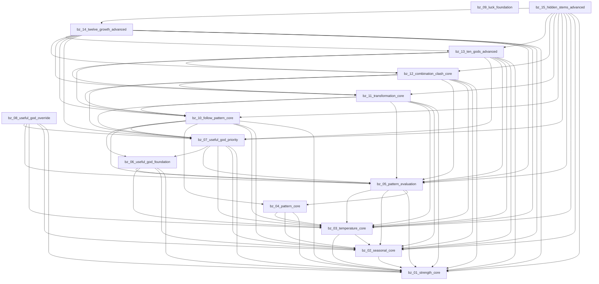

# Package Dependency Graph

Edges are taken only from `DEPENDENCIES.json` (`required` + `optional`). All current edges are **optional**.

## Graph

Arrow `A --> B` means **A optionally depends on B** (A consumes B’s published outputs).

## Cyclic dependency

**None.** DFS over the optional graph found 0 back-edges.

## Missing / dangling edges

**None.** Every `package_id` referenced in `DEPENDENCIES.json` exists in the released set.

## Orphan / unreachable

| Class | Packages | Notes |
| --- | --- | --- |
| No outbound deps (roots) | bz_01_strength_core, bz_09_luck_foundation | bz_01 is a healthy producer root. bz_09 declares no deps. |
| No inbound deps (leaves / isolated) | bz_08_useful_god_override, bz_15_hidden_stems_advanced, bz_09_luck_foundation | bz_08 / bz_15 are intended leaves until Interpretation. bz_09 is isolated from the analytical spine. |
| Unreachable from bz_01 spine | bz_09_luck_foundation | Parallel reference package; not consumed by bz_02–bz_15. |

## Required vs optional

| Kind | Count |
| --- | --- |
| Required dependencies | 0 |
| Optional dependencies | all declared edges |
| Conflicts | 0 |

Independently deployable policy is consistent: no hard required coupling.

## Consumer / producer relationships

See [PACKAGE_CONSUMER_MATRIX.md](PACKAGE_CONSUMER_MATRIX.md) and [PACKAGE_PRODUCER_MATRIX.md](PACKAGE_PRODUCER_MATRIX.md).
