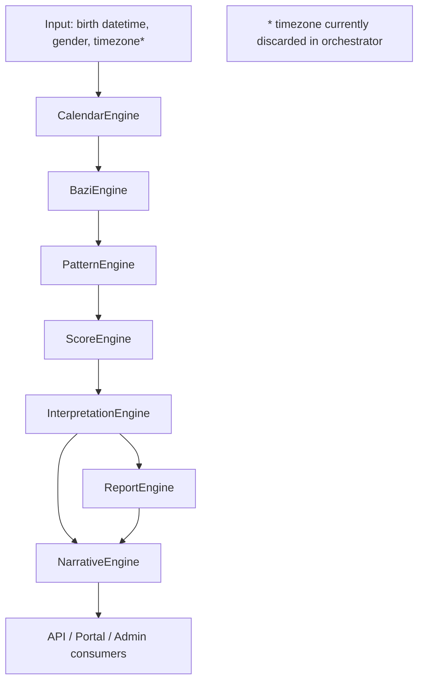
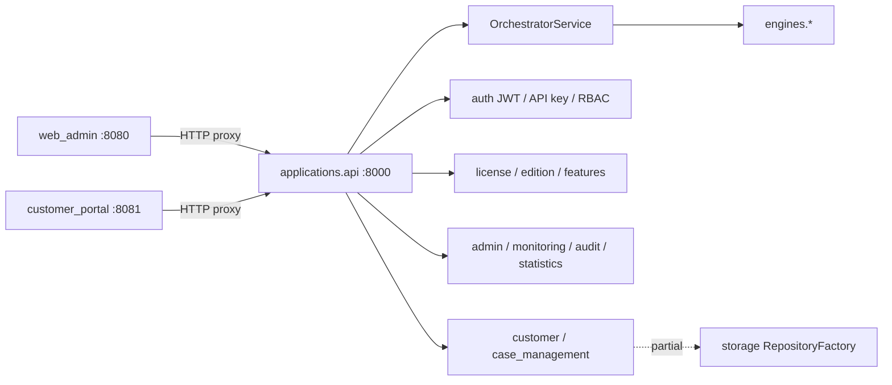

# BTE Platform — RC1 Dependency Graph

**Date:** 2026-07-24  
**Source of truth for runtime:** `applications/api/services/orchestrator.py`  
**Docs (stale):** `docs/module_dependencies.md`

---

## Runtime pipeline (canonical)



```
Input
  ↓
Calendar Engine
  ↓
Bazi Engine
  ↓
Pattern Engine
  ↓
Score Engine
  ↓
Interpretation Engine
  ↓
Report Engine ──┐
  ↓             │
Narrative Engine ←┘
  ↓
Customer Portal / Web Admin / API clients
```

---

## Application layer dependencies



---

## Engine dependency rules (as designed)

| Engine | May depend on | Must not import |
|--------|---------------|-----------------|
| Calendar | — | Later engines |
| Bazi | Calendar | Score+ |
| Pattern | Bazi context | Report/Narrative |
| Score | Calendar/Bazi/Pattern | Report/Narrative internals |
| Interpretation | Prior results | — |
| Report | Interpretation | Engines behind |
| Narrative | Interpretation + Report | — |

**Import probe:** calendar, bazi, pattern_engine, score, interpretation, report, narrative, priority, api.app, portals, license, storage, admin — **all OK**.

---

## Documented vs runtime mismatch

| Topic | Docs | Runtime |
|-------|------|---------|
| Score vs Pattern order | Score → Pattern | Pattern → Score |
| Narrative | Absent | Present after Report |
| Priority engine | Listed in packages | Not in analyze pipeline |

---

## Duplicate / parallel graphs (legacy)

```
api/*  ──?──► (legacy; not in configs/services.json)
applications/api/* ──► engines/*   (canonical)

engines/pattern/* ──?──►
engines/pattern_engine/* ──► orchestrator (canonical)
```

---

## Config service graph

From `configs/services.json`:

| Service | Module | Port |
|---------|--------|-----:|
| api | `applications.api.app:app` | 8000 |
| web_admin | `applications.web_admin.app:app` | 8080 |
| customer_portal | `applications.customer_portal.app:app` | 8081 |

---

## Dependency integrity score: **8.0 / 10**

Deducted for docs drift, legacy parallel trees, and incomplete storage wiring.
